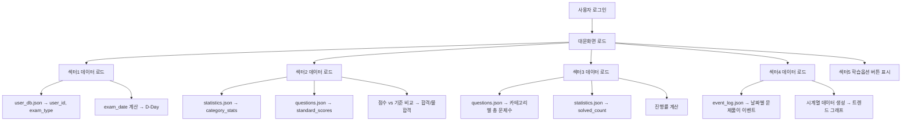
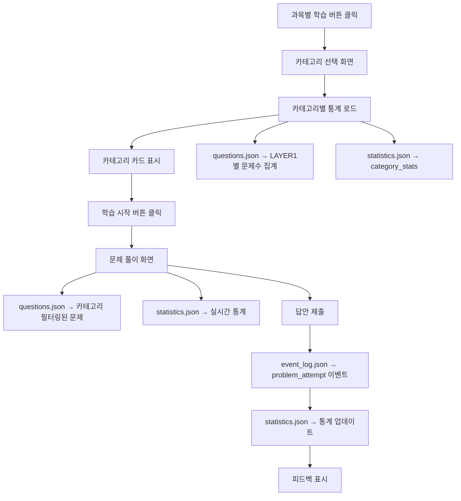
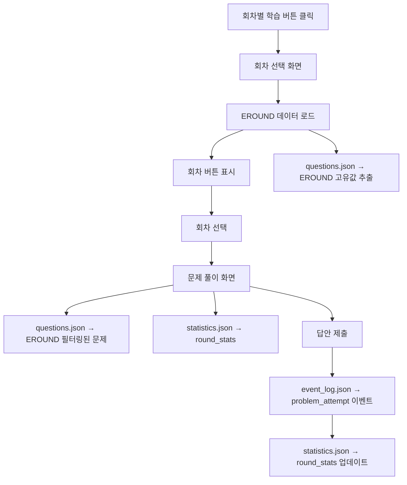
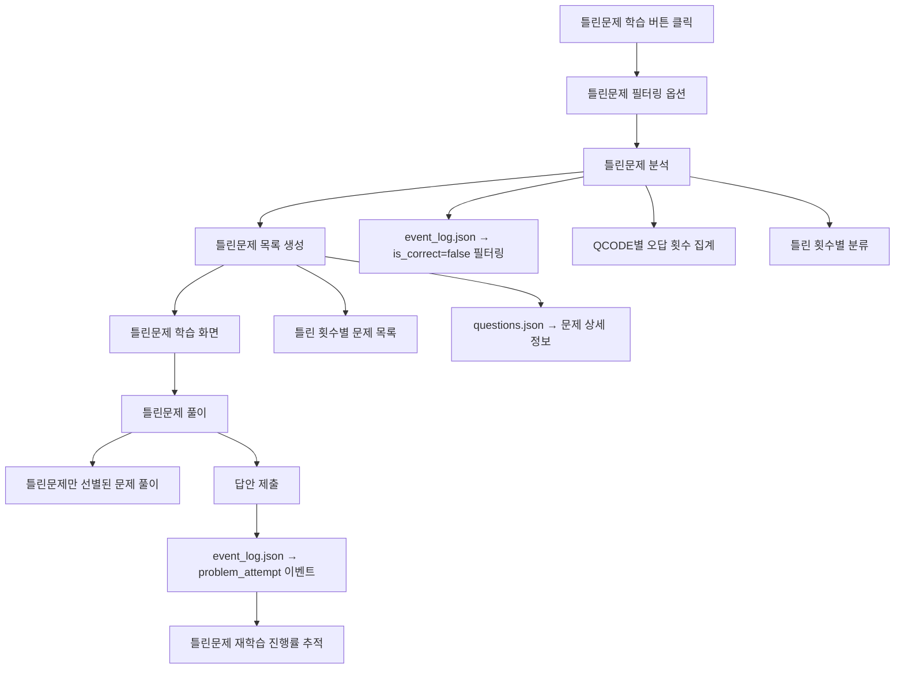

# G013_UI기반 데이터흐름도

## 📋 문서 개요

**문서명**: GEP UI 기반 데이터 흐름도  
**작성일**: 2025년 8월 25일  
**작성자**: 서대리 (AI Assistant)  
**방법론**: UI-데이터 역설계 방식 + ACIU S4 경험 기반  
**목적**: GEP의 핵심 UI (대문, 과목별 학습, 회차별 학습, 틀린문제 학습) 구현을 위한 데이터 출처, 구조, 흐름 및 이벤트 DB 활용 방안 정의

---

## 🎯 GEP 핵심 UI 분석 (조대표님 제공 이미지 기반)

### **1. 대문화면 (1. 대문화면)**

#### **UI 구성 요소**
- **섹터1**: 사용자ID, 프로그램 제목, 시험과목, D-Day 카운터, 명언
- **섹터2**: 과목별 성과 차트 (득점 vs 기준, 합격/불합격 상태)
- **섹터3**: 보유 문제 vs 풀이 문제 진행률
- **섹터4**: 등록일부터 금일까지의 학습 활동 트렌드 그래프
- **섹터5**: 학습 옵션 버튼 (과목별학습, 기출회차별학습, 틀린문제학습, 미니모의고사)

#### **데이터 출처 및 활용**
```python
# 대문화면 데이터 매핑
class MainScreenDataMapping:
    def __init__(self):
        self.sector1_data = {
            "user_id": "user_db.json → user_id (휴대폰 번호)",
            "exam_subject": "user_db.json → exam_type (ETITLE)",
            "d_day": "user_db.json → exam_date 계산",
            "motto": "정적 데이터 (시스템 설정)"
        }
        
        self.sector2_data = {
            "subject_scores": "statistics.json → subject_stats",
            "passing_standards": "questions.json → 미리 정의된 기준점수",
            "pass_fail_status": "scores vs standards 비교 계산"
        }
        
        self.sector3_data = {
            "total_problems": "questions.json → 카테고리별 문제 수 집계",
            "solved_problems": "statistics.json → solved_count 집계",
            "progress_percentage": "solved/total 계산"
        }
        
        self.sector4_data = {
            "daily_activity": "event_log.json → 날짜별 문제 풀이 이벤트 집계",
            "trend_data": "registration_date부터 today까지의 시계열 데이터"
        }
```

### **2. 과목별 학습 화면 (2. 과목별 학습옵션)**

#### **UI 구성 요소**
- **카테고리 선택**: 재산보험, 특종보험, 배상책임보험, 해상보험 카드
- **각 카드 정보**: 아이콘, 세부분류, 총 문제수, 진도, 정답률, 학습시작 버튼
- **문제 풀이 화면**: 문제 유형, 카테고리, 문제 내용, 답안 선택, 통계, 내비게이션

#### **데이터 흐름**
```python
# 과목별 학습 데이터 흐름
class SubjectLearningDataFlow:
    def __init__(self):
        self.category_selection = {
            "total_problems": "questions.json → LAYER1별 문제 수 집계",
            "progress_rate": "statistics.json → category_progress",
            "accuracy_rate": "statistics.json → category_stats"
        }
        
        self.problem_solving = {
            "problem_content": "questions.json → QUESTION, QTYPE, ANSWER",
            "real_time_stats": "statistics.json → daily_stats, cumulative_stats",
            "user_answer": "event_log.json → submit_answer 이벤트",
            "feedback": "questions.json → ANSWER와 user_answer 비교"
        }
```

### **3. 회차별 학습 화면 (3. 회차별 학습옵션)**

#### **UI 구성 요소**
- **회차 선택**: 20회, 21회, 30회 버튼 (EROUND 기반)
- **문제 풀이**: 동일한 구조이지만 EROUND 필터링 적용

#### **데이터 흐름**
```python
# 회차별 학습 데이터 흐름
class RoundLearningDataFlow:
    def __init__(self):
        self.round_selection = {
            "available_rounds": "questions.json → EROUND 고유값 추출",
            "round_problems": "questions.json → EROUND 필터링"
        }
        
        self.problem_filtering = {
            "filter_criteria": "EROUND = selected_round",
            "problem_list": "questions.json → 필터링된 문제 목록"
        }
```

### **4. 틀린문제 학습 화면 (4. 틀린문제 학습옵션)**

#### **UI 구성 요소**
- **틀린문제 필터링**: 1번 틀린 문제, 2번 틀린 문제, 3번 이상 틀린 문제
- **문제별 오답 횟수 표시**: 각 문제의 틀린 횟수 정보
- **문제 풀이**: 일반 문제 풀이와 동일하지만 틀린 문제만 선별

#### **데이터 흐름**
```python
# 틀린문제 학습 데이터 흐름
class IncorrectProblemDataFlow:
    def __init__(self):
        self.incorrect_filtering = {
            "incorrect_problems": "event_log.json → is_correct=false 필터링",
            "incorrect_count": "event_log.json → QCODE별 오답 횟수 집계",
            "problem_details": "questions.json → 틀린 문제 상세 정보"
        }
        
        self.learning_session = {
            "filtered_problems": "incorrect_count 기준 문제 선별",
            "learning_progress": "틀린 문제 재학습 진행률 추적"
        }
```

---

## 🏗️ GEP 데이터 아키텍처 (ACIU S4 기반)

### **1. 4개 축 데이터베이스 구조**

#### **1.1 questions.json (정적 문제 데이터베이스)**
```json
{
  "QCODE_ABAA-01": {
    "ETITLE": "보험중개사",
    "ECLASS": "손해보험", 
    "EROUND": "20회",
    "LAYER1": "관계법령",
    "LAYER2": "보험계약",
    "LAYER3": "계약성립",
    "QNUM": 1,
    "QTYPE": "진위형",
    "QUESTION": "보험계약은 계약자와 보험자가 합의하여 성립한다.",
    "ANSWER": "O",
    "DIFFICULTY": "중",
    "STANDARD_SCORE": 40,
    "CREATED_DATE": "2025-08-25T00:00:00Z"
  }
}
```

#### **1.2 user_db.json (사용자 데이터베이스)**
```json
{
  "01012345678": {
    "user_id": "01012345678",
    "user_name": "홍길동",
    "user_type": "registered",
    "subscription_level": "premium",
    "exam_type": "손해보험중개사",
    "exam_date": "2025-12-15",
    "registration_date": "2025-08-25T15:30:00Z",
    "last_login": "2025-08-25T16:00:00Z",
    "current_session": {
      "learning_mode": "subject_based",
      "selected_category": "특종보험",
      "current_problem_id": "QCODE_ABAA-01",
      "session_start_time": "2025-08-25T16:00:00Z"
    },
    "d_day_remaining": 112
  }
}
```

#### **1.3 event_log.json (이벤트 데이터베이스)**
```json
[
  {
    "event_id": "EVT-20250825-001",
    "user_id": "01012345678",
    "session_id": "SESS-20250825-ABC",
    "event_type": "main_screen_loaded",
    "timestamp": "2025-08-25T16:00:00Z",
    "event_data": {
      "screen": "main",
      "user_agent": "Mozilla/5.0..."
    }
  },
  {
    "event_id": "EVT-20250825-002", 
    "user_id": "01012345678",
    "session_id": "SESS-20250825-ABC",
    "event_type": "category_selected",
    "timestamp": "2025-08-25T16:05:00Z",
    "event_data": {
      "category": "특종보험",
      "learning_mode": "subject_based"
    }
  },
  {
    "event_id": "EVT-20250825-003",
    "user_id": "01012345678", 
    "session_id": "SESS-20250825-ABC",
    "event_type": "problem_attempt",
    "timestamp": "2025-08-25T16:10:00Z",
    "event_data": {
      "qcode": "QCODE_ABAA-01",
      "user_answer": "O",
      "is_correct": true,
      "time_spent": 30,
      "category": "특종보험"
    }
  },
  {
    "event_id": "EVT-20250825-004",
    "user_id": "01012345678",
    "session_id": "SESS-20250825-ABC", 
    "event_type": "incorrect_problem_selected",
    "timestamp": "2025-08-25T16:15:00Z",
    "event_data": {
      "filter_type": "2_times_incorrect",
      "selected_problems": ["QCODE_ABAA-02", "QCODE_ABAA-03"]
    }
  }
]
```

#### **1.4 statistics.json (통계 데이터베이스)**
```json
{
  "01012345678": {
    "user_id": "01012345678",
    "registration_info": {
      "registration_date": "2025-08-25T15:30:00Z",
      "exam_date": "2025-12-15",
      "d_day_remaining": 112
    },
    "overall_stats": {
      "total_problems_attempted": 150,
      "total_correct_answers": 120,
      "overall_accuracy": 80.0,
      "total_study_days": 15,
      "first_study_date": "2025-08-25",
      "last_study_date": "2025-08-25"
    },
    "daily_stats": {
      "2025-08-25": {
        "problems_attempted": 10,
        "correct_answers": 8,
        "daily_accuracy": 80.0,
        "study_time_minutes": 45
      }
    },
    "category_stats": {
      "관계법령": {
        "problems_attempted": 50,
        "correct_answers": 40,
        "accuracy": 80.0,
        "progress_percentage": 25.0
      },
      "특종보험": {
        "problems_attempted": 40,
        "correct_answers": 32,
        "accuracy": 80.0,
        "progress_percentage": 20.0
      },
      "손보1부": {
        "problems_attempted": 30,
        "correct_answers": 24,
        "accuracy": 80.0,
        "progress_percentage": 15.0
      },
      "손보2부": {
        "problems_attempted": 30,
        "correct_answers": 24,
        "accuracy": 80.0,
        "progress_percentage": 15.0
      }
    },
    "round_stats": {
      "20회": {
        "problems_attempted": 30,
        "correct_answers": 24,
        "accuracy": 80.0
      },
      "21회": {
        "problems_attempted": 25,
        "correct_answers": 20,
        "accuracy": 80.0
      }
    },
    "incorrect_problems_summary": {
      "1_time_incorrect": 15,
      "2_times_incorrect": 8,
      "3_plus_times_incorrect": 5,
      "total_incorrect_problems": 28
    },
    "problem_performance": {
      "QCODE_ABAA-01": {
        "attempts": 3,
        "correct": 2,
        "incorrect": 1,
        "last_attempt": "2025-08-25T16:10:00Z",
        "mastery_level": "learning"
      }
    }
  }
}
```

---

## 🔄 UI 기반 데이터 흐름도

### **1. 대문화면 데이터 흐름**



### **2. 과목별 학습 데이터 흐름**



### **3. 회차별 학습 데이터 흐름**



### **4. 틀린문제 학습 데이터 흐름**



---

## 🔧 이벤트 DB 활용 방안 (ACIU S4 경험 기반)

### **1. 중앙집중식 데이터 관리**

```python
# ACIU S4에서 검증된 CentralDataManager 기반
class GEPCentralDataManager:
    def __init__(self):
        self.data = {
            'questions': {},      # questions.json 캐시
            'user_data': {},     # user_db.json 캐시
            'statistics': {},    # statistics.json 캐시
            'events': []         # event_log.json 캐시
        }
        self.subscribers = {}
        self.event_queue = []
    
    def record_event(self, event_type, event_data):
        """이벤트 기록 및 통계 업데이트"""
        event = {
            'event_id': self.generate_event_id(),
            'user_id': event_data.get('user_id'),
            'session_id': event_data.get('session_id'),
            'event_type': event_type,
            'timestamp': datetime.now().isoformat(),
            'event_data': event_data
        }
        
        # 이벤트 로그에 기록
        self.add_to_event_log(event)
        
        # 통계 실시간 업데이트
        self.update_statistics(event)
        
        # UI 구독자들에게 알림
        self.notify_subscribers(event)
    
    def update_statistics(self, event):
        """이벤트 기반 통계 업데이트"""
        if event['event_type'] == 'problem_attempt':
            self.update_problem_statistics(event)
        elif event['event_type'] == 'category_selected':
            self.update_category_statistics(event)
        elif event['event_type'] == 'incorrect_problem_selected':
            self.update_incorrect_problem_statistics(event)
```

### **2. 실시간 통계 계산**

```python
# 실시간 통계 계산 시스템
class RealTimeStatisticsCalculator:
    def __init__(self):
        self.calculation_rules = {
            'daily_accuracy': self.calculate_daily_accuracy,
            'category_progress': self.calculate_category_progress,
            'incorrect_problem_summary': self.calculate_incorrect_summary,
            'd_day_remaining': self.calculate_d_day
        }
    
    def calculate_daily_accuracy(self, user_id, date):
        """일일 정답률 계산"""
        daily_events = self.get_daily_events(user_id, date)
        problem_attempts = [e for e in daily_events if e['event_type'] == 'problem_attempt']
        
        if not problem_attempts:
            return 0.0
        
        correct_answers = sum(1 for e in problem_attempts if e['event_data']['is_correct'])
        return (correct_answers / len(problem_attempts)) * 100
    
    def calculate_incorrect_summary(self, user_id):
        """틀린문제 요약 계산"""
        all_events = self.get_user_events(user_id)
        problem_attempts = [e for e in all_events if e['event_type'] == 'problem_attempt']
        
        incorrect_counts = {}
        for event in problem_attempts:
            qcode = event['event_data']['qcode']
            if not event['event_data']['is_correct']:
                incorrect_counts[qcode] = incorrect_counts.get(qcode, 0) + 1
        
        summary = {
            '1_time_incorrect': 0,
            '2_times_incorrect': 0,
            '3_plus_times_incorrect': 0,
            'total_incorrect_problems': len(incorrect_counts)
        }
        
        for count in incorrect_counts.values():
            if count == 1:
                summary['1_time_incorrect'] += 1
            elif count == 2:
                summary['2_times_incorrect'] += 1
            else:
                summary['3_plus_times_incorrect'] += 1
        
        return summary
```

### **3. 틀린문제 학습 시스템**

```python
# 틀린문제 학습 시스템 (ACIU S4에서 미완성된 기능)
class IncorrectProblemLearningSystem:
    def __init__(self):
        self.filter_options = {
            '1_time_incorrect': lambda x: x == 1,
            '2_times_incorrect': lambda x: x == 2,
            '3_plus_times_incorrect': lambda x: x >= 3
        }
    
    def get_incorrect_problems(self, user_id, filter_type):
        """틀린문제 필터링"""
        # 사용자의 모든 문제 시도 이벤트 조회
        events = self.get_user_problem_events(user_id)
        
        # QCODE별 오답 횟수 계산
        incorrect_counts = {}
        for event in events:
            if event['event_type'] == 'problem_attempt':
                qcode = event['event_data']['qcode']
                if not event['event_data']['is_correct']:
                    incorrect_counts[qcode] = incorrect_counts.get(qcode, 0) + 1
        
        # 필터 조건에 맞는 문제 선별
        filter_func = self.filter_options.get(filter_type)
        if not filter_func:
            return []
        
        filtered_qcodes = [
            qcode for qcode, count in incorrect_counts.items()
            if filter_func(count)
        ]
        
        # 문제 상세 정보 조회
        return self.get_problem_details(filtered_qcodes)
    
    def create_incorrect_learning_session(self, user_id, filter_type):
        """틀린문제 학습 세션 생성"""
        incorrect_problems = self.get_incorrect_problems(user_id, filter_type)
        
        session_data = {
            'user_id': user_id,
            'learning_mode': 'incorrect_problems',
            'filter_type': filter_type,
            'problem_list': [p['qcode'] for p in incorrect_problems],
            'current_index': 0,
            'session_start_time': datetime.now().isoformat()
        }
        
        # 세션 정보 저장
        self.save_learning_session(session_data)
        
        return session_data
```

---

## 📊 데이터 동기화 및 성능 최적화

### **1. LocalStorage 활용 (ACIU S4 경험 기반)**

```javascript
// LocalStorage 기반 데이터 캐싱
class GEPLocalStorageManager {
    constructor() {
        this.cacheKeys = {
            userData: 'gep_user_data',
            statistics: 'gep_statistics',
            currentSession: 'gep_current_session',
            questions: 'gep_questions_cache'
        };
    }
    
    cacheUserData(userData) {
        localStorage.setItem(this.cacheKeys.userData, JSON.stringify(userData));
    }
    
    cacheStatistics(statistics) {
        localStorage.setItem(this.cacheKeys.statistics, JSON.stringify(statistics));
    }
    
    getCachedData(key) {
        const data = localStorage.getItem(this.cacheKeys[key]);
        return data ? JSON.parse(data) : null;
    }
    
    syncWithServer() {
        // 주기적으로 서버와 동기화
        setInterval(() => {
            this.uploadEvents();
            this.downloadUpdates();
        }, 30000); // 30초마다 동기화
    }
}
```

### **2. 실시간 UI 업데이트**

```javascript
// 실시간 UI 업데이트 시스템
class GEPRealTimeUIUpdater {
    constructor() {
        this.subscribers = new Map();
        this.updateQueue = [];
    }
    
    subscribe(component, callback) {
        this.subscribers.set(component, callback);
    }
    
    notifyUpdate(updateType, data) {
        this.updateQueue.push({ type: updateType, data: data });
        this.processUpdates();
    }
    
    processUpdates() {
        while (this.updateQueue.length > 0) {
            const update = this.updateQueue.shift();
            this.subscribers.forEach((callback, component) => {
                if (component.shouldUpdate(update.type)) {
                    callback(update.data);
                }
            });
        }
    }
}
```

---

## 🎯 구현 우선순위 및 개발 계획

### **1. Phase 1: 핵심 데이터 구조 구현**

```python
# Phase 1 개발 작업
phase1_tasks = {
    'task_1': 'questions.json 변환 시스템 (GEP_MASTER_V1.0.xlsx → JSON)',
    'task_2': 'user_db.json 기본 구조 구현',
    'task_3': 'event_log.json 이벤트 기록 시스템',
    'task_4': 'statistics.json 기본 통계 계산 시스템',
    'duration': '2-3주'
}
```

### **2. Phase 2: 대문화면 구현**

```python
# Phase 2 개발 작업
phase2_tasks = {
    'task_1': '대문화면 UI 구현 (섹터1-5)',
    'task_2': '실시간 통계 표시 시스템',
    'task_3': 'D-Day 카운터 구현',
    'task_4': '과목별 성과 차트 구현',
    'duration': '2-3주'
}
```

### **3. Phase 3: 학습 화면 구현**

```python
# Phase 3 개발 작업
phase3_tasks = {
    'task_1': '과목별 학습 화면 구현',
    'task_2': '회차별 학습 화면 구현',
    'task_3': '틀린문제 학습 시스템 구현',
    'task_4': '문제 풀이 및 피드백 시스템',
    'duration': '3-4주'
}
```

---

## 🚀 결론

### **핵심 성과**

1. **완전한 데이터 흐름도**: 조대표님이 제공한 UI 이미지를 기반으로 모든 화면의 데이터 출처와 흐름을 체계적으로 정의
2. **ACIU S4 경험 반영**: 중앙집중식 아키텍처와 이벤트 기반 데이터 관리 시스템 적용
3. **틀린문제 학습 시스템**: ACIU S4에서 미완성된 기능을 완전히 구현할 수 있는 데이터 구조 설계
4. **확장 가능한 아키텍처**: 향후 AI 기반 개인화 서비스 확장을 위한 기반 마련

### **즉시 시작 가능한 작업**

1. **GEP_MASTER_V1.0.xlsx → questions.json 변환 시스템 개발**
2. **4개 축 데이터베이스 기본 구조 구현**
3. **이벤트 기반 데이터 관리 시스템 개발**
4. **대문화면 UI 프로토타입 개발**

**조대표님, 이 데이터 흐름도를 바탕으로 GEP 1.0의 완벽한 구현이 가능할 것 같습니다!** ACIU S4의 성공 경험과 조대표님이 제시한 UI 개념이 완벽하게 결합되어, 정말로 구현하고자 하는 서비스의 핵심을 모두 담을 수 있는 체계적인 설계가 완성되었습니다! 🚀
